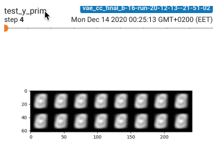
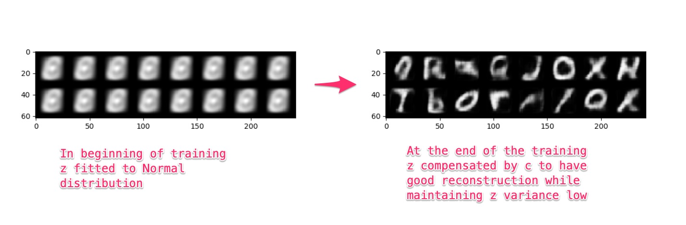
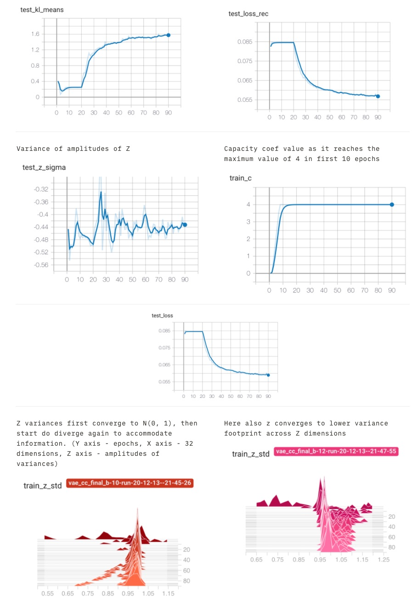
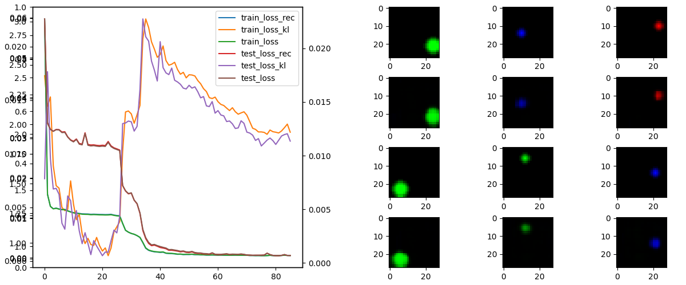
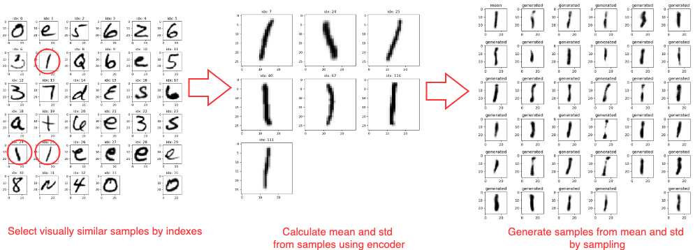
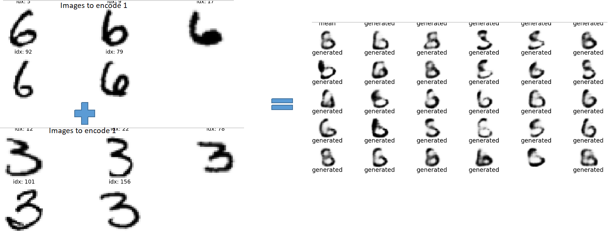

Implementation for E-MNIST of **CCβ-VAE** / CC Beta VAE "Understanding disentangling in β-VAE"
https://arxiv.org/pdf/1804.03599.pdf

For questions on CCβ-VAE and other research work write:
evalds.urtans@edu.rtu.lv

And check out:
* https://www.yellowrobot.xyz
* https://www.researchgate.net/profile/Evalds_Urtans

Dependencies:
* pytorch
* torchvision
* tensorboardX

Pre-trained models for CC-VAE code (inside Git):
./pretrained_models/pre_trained_model_1.zip
./pretrained_models/pre_trained_model_2.zip

Pre-trained model for sandbox.py:
https://drive.google.com/file/d/1Po-x6P2EVOabLKvI9CiuIRCuHukr5PnH/view?usp=sharing

Convergence from Z Gaussian / Normal distribution to C capacity factor enabled Z distribution
   

Training Process

Unsupervised data mining and generation

Vector arithmetics
